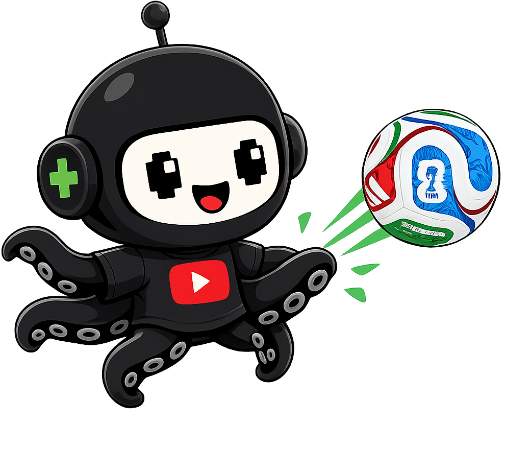

<div align="center">



# YTFut

**your YouTube channel, rated out of 99** ⚽


<br/><br/>

<a href="https://ytfut.com/u/@mrbeast"></a>
<a href="https://ytfut.com/u/@mkbhd"></a>

<br/><br/>

</div>

<br/>

## 🃏 &nbsp;Embed your card

Your card lives at a URL. Drop it in your markdown, website, portfolio, anywhere — and it **re-rates itself** as your stats change.

```md
[](https://ytfut.com/u/YOUR_USERNAME)
```

| | |
|---|---|
| **`ytfut.com/api/card-image/<username>`** | your card, as a live image |
| **`ytfut.com/u/<username>`** | the full rating report |
| **`?country=XX`** | override the flag (e.g. `?country=DZ`) |

<br/>

## ⚙️ &nbsp;How the rating works

Six signals from a live YouTube channel, each mapped to a football stat — read straight from YouTube's Data API. No surveys, no self-reporting. Just the content.

| | Stat | Rated from |
|:--:|:--|:--|
| **PAC** | Pace | Uploads frequency and schedule consistency |
| **SHO** | Shooting | Recent average view counts and virality pulls |
| **PAS** | Passing | Audience engagement (recent comments & likes per view) |
| **DRI** | Dribbling | Content versatility (number of unique genres covered) |
| **DEF** | Defending | Average like-to-view ratios and community alignment |
| **PHY** | Physical | Channel longevity (age) and total views |

Your **overall** is the headline. Raw stats cap at **88** — the 90s are a legacy gate, earned with years and influence, so one heroic year won't crown you an Icon. Your **position** and **archetype** are read from your stat shape: a shooting spike rates a poacher up top, a defending-and-passing lean rates a deep playmaker.

Every card walks out in a finish:

<div align="center">


</div>

<br/>

<div align="center">

**Built with** Next.js · TypeScript · Tailwind · Redis

**[ytfut.com](https://ytfut.com)** &nbsp;·&nbsp; rate someone today


</div>
